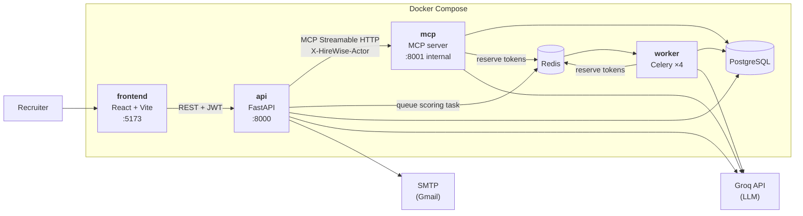

# HireWise — AI-Powered Recruitment Screening

*[Tiếng Việt](README.md) · English*

HireWise takes a job description written in plain language and a ZIP of dozens of CVs,
then returns **a ranked shortlist you can actually audit**: every candidate gets a score
broken down across six axes, with strengths, weaknesses, and **verbatim quotes from the
CV** backing each claim.

The interesting engineering isn't "call an LLM to score a CV" — it's three harder
problems underneath:

- **Scores must be traceable.** Weights live in code, not in the model's head; the total
  is computed by multiplying and summing those weights. A recruiter can always explain
  why 62 is 62.
- **The free tier has to survive a real batch.** Groq caps *tokens per minute*, not
  request count. A 15-CV ZIP blows through that instantly if you fire everything at
  once. A Redis-backed rate limiter reserves token budget ahead of every call, shared
  across every process.
- **The AI agent genuinely runs over MCP.** The recruiter's chat box calls tools through
  the **Model Context Protocol** (Streamable HTTP) rather than invoking Python functions
  directly, with a controlled fallback path and a hard identity boundary between the two
  sides.

> Coursework for **Introduction to Software Engineering** — University of Science,
> VNU-HCM. June–August 2026, 111 commits.

---

## Contents

- [Features](#features)
- [Screens](#screens)
- [Architecture](#architecture)
- [Tech stack](#tech-stack)
- [How a CV gets scored](#how-a-cv-gets-scored)
- [The AI agent and MCP](#the-ai-agent-and-mcp)
- [LLM budget throttling](#llm-budget-throttling)
- [Security and access control](#security-and-access-control)
- [Running the project](#running-the-project)
- [Environment variables](#environment-variables)
- [Testing](#testing)
- [Repository layout](#repository-layout)
- [API](#api)
- [Database](#database)

---

## Features

| Area | What it does |
|---|---|
| Accounts | JWT sign-up and sign-in, email verification via 6-digit OTP, password change, two roles (`admin`, `hr_staff`) |
| Job descriptions | Write a JD in plain language; the LLM extracts structure (required and preferred skills, years of experience, education, languages, responsibilities) and rebuilds it as markdown for review |
| CV ingestion | Upload a ZIP of CVs, unpack, extract text with PyMuPDF, de-duplicate by SHA-256, track per-batch progress |
| Scoring | Celery queue scores in the background against a six-axis rubric with fixed weights, plus verbatim evidence from the CV |
| Ranking | Per-project leaderboard; recruiters can override the AI score — the change is flagged and an edit history is kept |
| Comparison | Put several candidates head-to-head on an aspect the recruiter names; the LLM reads the original CVs and argues directly |
| Interviews | Generate questions anchored to real projects in the CV and aimed at weak spots, grade answers, summarise the session |
| Shortlists | Accept or reject, send interview invitations and decision emails, track delivery status per person |
| Email templates | Two templates (accepted, rejected) with the dynamic tokens `{candidate_name}`, `{jd_title}`, `{hr_name}` and per-recruiter attachments |
| Copilot | Chat box driving 20 tools over MCP: lookups, JD creation, question generation, sending mail, and navigating the open screen |
| Administration | User management; system, audit, LLM-call and agent-tool logs; business metrics; CSV export; system-wide announcements |
| Trash | Soft-delete projects, restore, or purge permanently |

---

## Screens

### Dashboard

Each card is one hiring campaign for one role, with the number of CVs ingested. The
right-hand column is the Copilot chat — from `lg` up it is a fixed column, not a panel
you open and close.


### Create a project

Two boxes, one flow: describe the role in plain prose on the left, drop a `.zip` of CVs
on the right. The LLM turns the prose into a structured JD while the archive is unpacked
and queued for scoring, all from the same click.


### Project detail

The AI-generated JD sits on the left; upload batches and scoring progress on the right.
The *CV Processing (live)* block shows per-candidate status in real time — the UI polls
`GET /jds/{id}/candidates` while the Celery worker is still going.


### Leaderboard

Ordered by match score, with the key skills pulled from each CV. This ordering shares one
ranking function with the shortlist view (`app/core/ranking.py`), so the two tables can
never show tied candidates in two different orders.


### Candidate detail — a score you can trace

This is the screen that answers *"where does 81 come from?"*. The total sits at the top;
below it each axis with its weight (required skills 35%, experience 25%, …); and under
each axis the evidence: ✓ for what was found in the CV, ✕ for what the JD asked for and
the CV lacks. The original CV opens alongside for comparison.


The pencil icon at the top lets a recruiter override the AI score. The change is flagged
and written to `evaluation_overrides` with the previous value, the editor and a timestamp,
then the leaderboard re-ranks.

### Copilot

The recruiter types a request in plain language; the agent picks a tool, calls it over
MCP, and answers. Below is a real `list_jds` turn.


### Email templates

An editor for the two letters (accepted, rejected). Dynamic variables are dragged in as
single solid chips rather than typed out as `{candidate_name}` — one Backspace removes
the whole variable instead of leaving broken syntax behind.


> Every image above is **generated**, by `npm run screenshots` inside `src/frontend`,
> so a re-capture always comes back at the same size. See
> [`docs/screenshots/README.md`](docs/screenshots/README.md) for how to run it.

---

## Architecture



What each service does:

- **frontend** — the recruiter UI and the admin gateway. The dev server proxies every
  backend prefix, so the Python side needs no CORS configuration.
- **api** — the source of truth and the **only door users come in through**: authentication,
  authorisation, per-owner data scoping, mail, and the **MCP client** behind the chat box.
  It is also the only service that runs migrations at startup.
- **worker** — Celery, four concurrent processes, scoring CVs in the background so the
  upload request never blocks. Four matches the number of independent budget lanes:
  2 Groq accounts × 2 models.
- **mcp** — the **internal MCP server**, deliberately not published to the host. Only
  `api` reaches it, by the service name `mcp` on the Docker network.
- **redis** — both the Celery broker (DB 0, results in DB 1) and the **shared LLM budget
  ledger** (DB 2) for all three calling processes.

---

## Tech stack

| Layer | Technology |
|---|---|
| Frontend | React 18, react-router-dom 6, Vite 6, Tailwind CSS v4, lucide-react |
| Backend | Python 3.11, FastAPI, SQLAlchemy 2, Alembic, Pydantic v2, python-jose (JWT), passlib + bcrypt |
| Background work | Celery 5 + Redis |
| AI | Groq (OpenAI-compatible), **MCP SDK 1.12+** (Streamable HTTP) |
| CV reading | PyMuPDF |
| Data | PostgreSQL 15 |
| Infrastructure | Docker, Docker Compose |
| Testing | pytest, Playwright, Locust |

---

## How a CV gets scored

**1. Ingestion.** The ZIP is unpacked in memory and only `.pdf` entries are kept. Each
file is text-extracted with PyMuPDF and hashed with SHA-256 — that hash both de-duplicates
within a project and names the stored file. A scanned-image CV yields empty text and is
marked `FAILED` with a reason, rather than sitting silently in a pending state.

**2. Queueing.** The upload request returns as soon as candidate rows exist; scoring
happens on the Celery worker. The UI polls `GET /jds/{id}/candidates` for progress.

**3. Parse then score — two LLM calls per CV, not three.** The first version made three
calls per CV and sent the full CV text twice (parsing, then evidence hunting). That alone
consumed roughly 40% of the per-CV token budget and guaranteed a rate-limit wall on a
15-CV upload. Evidence hunting was folded into the scoring call itself, and that call
receives only the **already-extracted** fields rather than the raw CV again.

**4. The rubric is fixed in code.**

| Axis | Weight | What it measures |
|---|---:|---|
| Required skills | 35 | Coverage of the JD's `required_skills`, counting equivalents |
| Experience | 25 | Years **and** how relevant past work is to the JD's responsibilities |
| Projects & achievements | 15 | Measurable outcomes preferred over a list of technologies |
| Education | 10 | Degree and field; strong practical experience offsets a mismatched degree |
| Preferred skills & certifications | 10 | `preferred_skills`, certificates, awards, relevant soft skills |
| Languages | 5 | If the JD asks for none, score neutral rather than penalising |

Weights live **in code, not in the model's choice**, and the total is computed by the
application. The earlier version let the model return a `score` alongside a
`score_breakdown`; nothing tied the two together, so a breakdown of 90/85/80 regularly
produced a total of 62. Fixing the formula makes scores both explainable per axis and
**comparable across candidates**, because everyone is measured the same way.

**5. Evidence.** For every strength and weakness the model must return a **verbatim**
quote from the CV, or `null` if it cannot find one — the recruiter clicks through to the
exact passage instead of taking the model's word for it.

**6. Out of budget means retry, not reject.** When a task hits the Groq limit, Celery
reschedules it (up to 12 times). Only after the retries are exhausted is the candidate
marked `FAILED` with a message — so a recruiter never stares at a screen assuming work is
still in flight.

---

## The AI agent and MCP

The Copilot chat box is not a passive assistant: the LLM is the main program, choosing
and calling tools that read and write real recruitment data.

```
run_agent  ──►  mcp_client  ──(Streamable HTTP)──►  MCP server  ──►  agent_tools  ──►  DB
```

The tool list is **not hard-coded**: the backend asks the MCP server for `list_tools()`
and hands those schemas to the LLM. There are 20 tools in three groups — lookups
(`list_jds`, `search_candidates`, `compare_candidates`, …), writes (`create_jd`,
`create_shortlist`, `send_interview_invite`, `set_candidate_decision`, …) and UI
navigation (`open_jd`, `open_dashboard`, `open_shortlisting`).

Four design decisions worth calling out:

**One source of truth for the tool surface.** Tools used to be described by hand in two
parallel places: the JSON schema for Groq, and the `@mcp.tool()` wrappers in the MCP
server. The two really did drift — `send_interview_invite` existed on the Groq side but
was never registered with the MCP server, while the system prompt kept telling the LLM to
use it, so the primary path had no way to send an interview invitation. Now there is only
`tool_registry.py`; both consumers are **generated** from it. Adding a tool means adding
one `ToolSpec`.

**Identity travels with the session, not with the tool call.** `X-HireWise-Actor` is a
header on the MCP session, so `acting_user_id` never appears in a tool schema — the LLM
cannot see it and cannot impersonate anyone. The server still re-verifies that identity
against the `users` table. `owner_id` is injected into **every** tool, not just writes, so
a tool added later cannot accidentally read another recruiter's data.

**A fallback with a hard rule.** If the MCP server is unreachable, the agent falls back to
calling the Python functions in-process so the product does not die mid-demo. But if MCP
drops **after** a write tool has already succeeded, the turn is never replayed — replaying
would create a second JD and send a second email. That case reports an honest error
instead. MCP's `read_only` annotation is used for real to tell those two situations apart.

**Every tool runs on a worker thread.** FastMCP invokes synchronous tools directly on the
event loop, and the tools here are blocking code (psycopg2 queries, LLM calls, the rate
limiter's `sleep`). Left alone, one batch of interview-question generation for eight
candidates holds the loop for tens of seconds: a second client never gets read,
`/healthz` stops answering so Docker marks the container unhealthy, and the Streamable
HTTP stream cannot emit keep-alives, so the session drops mid-flight.

---

## LLM budget throttling

Groq's limits apply per **account**, not per process. Previously each Celery worker called
the API the moment it picked up a task, so a 15-CV ZIP fired dozens of near-simultaneous
calls — mass 429s, blind retries, and CVs marked `FAILED`.

The current approach counts requests and tokens spent within per-minute and per-day
windows **in Redis**, the one place every container sees the same numbers. Every call must
**reserve** its estimated tokens first; when the budget is gone, the caller waits for the
window to reopen instead of firing and eating a 429. The windows are fixed rather than
sliding — far simpler, and still safe because only 85% of the real quota is ever spent.

Three lines of defence, in order: reserve tokens up front → honour Groq's `retry-after`
header if a 429 still happens → raise `LLMBudgetExhausted` so Celery reschedules that CV.

The budget is also **split into lanes**: the CV pipeline uses two separate Groq accounts
(double the tokens), while the Copilot chat uses a third key — so a heavy upload never
costs the recruiter their conversation.

---

## Security and access control

- **JWT with bcrypt at 12 rounds.** Sign-up requires email verification via a 6-digit OTP
  before the account activates.
- **Two roles.** `hr_staff` uses the recruitment side, `admin` uses the gateway. The React
  route guard is a navigation convenience only; enforcement lives in
  `app/core/dependencies.py`.
- **Per-owner data scoping.** Every business query goes through the guards in
  `app/core/ownership.py` (`get_owned_jd`, `get_owned_candidate`, `get_owned_shortlist`, …),
  so one recruiter cannot read another's project even knowing the UUID.
- **The MCP port is not exposed to the host.** Publishing 8001 would open a direct path
  into recruitment data with no login and no JWT in the way. An earlier version bound
  `0.0.0.0:8001`, meaning the whole LAN could reach it. Now only the `api` container can,
  and every request must still carry `Authorization: Bearer $MCP_AUTH_TOKEN`. Without that
  variable the MCP server **refuses to start** — carrying on quietly is how you end up with
  an anonymous read/write endpoint.
- **Logging.** Four separate tables: `audit_logs` (user actions), `system_logs`, `ai_logs`
  (every LLM call with tokens and latency), and `agent_tool_logs` (every tool the agent
  called, with arguments). Admins can export CSV from the UI.

---

## Running the project

**Requirements:** Docker and Docker Compose.

```bash
git clone https://github.com/chovy02/HireWise.git
cd HireWise
cp .env.example .env
```

Open `.env` and fill in at minimum: the PostgreSQL password, `SECRET_KEY`,
`MCP_AUTH_TOKEN`, and at least one Groq key. SMTP can stay empty — mail features report
"not configured" rather than breaking anything else.

```bash
docker compose up --build
```

| Service | URL |
|---|---|
| Frontend | http://localhost:5173 |
| Backend | http://localhost:8000 |
| API docs (Swagger UI) | http://localhost:8000/docs |
| PostgreSQL | `localhost:5433` |
| Redis | `localhost:6379` |
| MCP server | *not published — reachable only inside the Docker network* |

On first `up`, the `api` service runs `python -m app.prestart` before uvicorn accepts
requests: it waits for Postgres and syncs the schema. Without that step, any machine with
an older DB volume crashes at startup on a missing column and the frontend just shows
"Backend not reachable". **Only** `api` runs migrations — all three containers share one
image, and letting all three migrate means racing each other on one database.

An admin account is seeded at startup from `DEFAULT_ADMIN_EMAIL` and
`DEFAULT_ADMIN_PASSWORD`. Sign in with it, then create recruiter accounts from the admin
gateway (admin-created accounts are active immediately and skip email verification).

### Agent REPL, no UI needed

```bash
docker exec -it hirewise_api python agent_repl.py --debug
```

Type a request; `--debug` prints which tools the agent called and with what arguments.

---

## Environment variables

No `.env` file is committed. See [`.env.example`](.env.example) for the full list.

| Variable | Purpose |
|---|---|
| `POSTGRES_USER` / `POSTGRES_PASSWORD` / `POSTGRES_DB` | PostgreSQL initialisation |
| `DATABASE_URL` | Backend connection string — the host must be `db`, not `localhost` |
| `SECRET_KEY` | JWT signing key. Generate one: `openssl rand -hex 32` |
| `DEFAULT_ADMIN_EMAIL` / `DEFAULT_ADMIN_PASSWORD` | Admin account seeded at startup |
| `MCP_AUTH_TOKEN` | Bearer token for the internal MCP port. **Missing it stops the MCP server from starting** |
| `MAIL_USERNAME` / `MAIL_PASSWORD` / `MAIL_FROM` / `MAIL_SERVER` / `MAIL_PORT` | SMTP. Gmail needs a 16-character app password |
| `GROQ_API_KEY_1` / `GROQ_API_KEY_2` | Two accounts for the CV pipeline — double the token budget |
| `GROQ_MCP_API_KEY` | Separate key for the Copilot chat, in its own budget lane |
| `GROQ_MODEL` / `GROQ_MODEL_BACKUP` / `GROQ_MODEL_FAST` / `GROQ_FALLBACK_MODELS` | Primary model and the fallback chain |
| `LLM_SAFETY_RATIO` | Fraction of the real quota that may be spent, default `0.85` |

---

## Testing

### Backend — 82 cases, fully offline

No external API calls, no keys required. Run them in the `mcp` container, since the MCP
tests need to read `server.py` (only that container mounts it):

```bash
docker exec hirewise_mcp sh -c "cd /app && python -m pytest tests -q"
```

<!-- Latest run: 82 passed. -->

Four groups, each aimed at something that has actually broken:

| File | What it guards |
|---|---|
| `test_agent_tools_resolve.py` | LLMs rewrite candidate and role names loosely; which spellings **must** still match, and that a name the LLM invented never becomes a write |
| `test_agent_tools_guards.py` | An ambiguous request spanning several roles must ask back and **write nothing** |
| `test_mcp_contract.py` | The contract between the registry, the MCP server and the fallback: every registry tool exists on both paths, and identity never travels as a tool argument |
| `test_mcp_runtime.py` | `/healthz` is the only unauthenticated route; no tool may block the event loop |

> Run inside the `api` container instead and 30 MCP cases **skip** (that container does
> not mount `server.py`). That is correct behaviour, not a failure.

### Frontend end-to-end

```bash
cd src/frontend
npm run test:e2e
```

Playwright starts Vite itself. The login suite runs **with the backend switched off**,
because it only checks what the frontend decides on its own: route guards, rendering,
navigation, and browser validation.

### Response-time measurement (NFR)

The Locust suite in [`src/backend/tests/load/`](src/backend/tests/load) measures per-
endpoint latency, compares it against budgets published in advance, and returns a pass or
fail verdict. Six budget groups, from instant lookups (300 ms) up to the LLM path.

Latest run — [`load-report/slo-report.md`](src/backend/tests/load/load-report/slo-report.md):

| Metric | Value |
|---|---|
| Endpoints measured | 25 |
| Within budget | 25 |
| Over budget | 0 |
| HTTP error rate | 0.0% |

Data preparation and load-profile selection are documented in
[`tests/load/README.md`](src/backend/tests/load/README.md).

---

## Repository layout

```
HireWise/
├── src/
│   ├── backend/                  FastAPI — API, auth, domain logic, AI
│   │   ├── app/
│   │   │   ├── routers/          10 routers: auth, users, cv, shortlist, interview,
│   │   │   │                       compare, agent, admin, notifications, email_templates
│   │   │   ├── services/
│   │   │   │   ├── ai_agent/     Agent loop, MCP client, tool registry, scorer,
│   │   │   │   │                   comparator, interviewer, rate limiter
│   │   │   │   ├── cv_processing/  PDF text extraction, file storage
│   │   │   │   └── data_ingestion/ ZIP unpacking, SHA-256 de-duplication
│   │   │   ├── core/             Ownership guards, RBAC, ranking, Celery, bootstrap
│   │   │   ├── schemas/          Pydantic v2
│   │   │   └── models.py         21 SQLAlchemy tables
│   │   ├── migrations/           20 Alembic revisions
│   │   ├── tests/                Offline tests + the Locust load suite
│   │   └── agent_repl.py         Terminal REPL for the agent
│   ├── frontend/                 React + Vite + Tailwind v4 (has its own README)
│   └── mcp_server/server.py      Internal MCP server, generated from the registry
├── docs/
│   ├── screenshots/              README screenshots (generated with Playwright)
│   └── kien-truc-hirewise.drawio Architecture diagram
├── cv_data/                      Sample CV archives for testing
├── docker-compose.yml
└── .env.example
```

---

## API

67 endpoints, self-documented at http://localhost:8000/docs. The main groups:

| Group | Representative endpoints |
|---|---|
| Authentication | `POST /auth/register` · `POST /auth/verify-email` · `POST /auth/login` · `GET /auth/me` |
| Job descriptions | `POST /jds` · `GET /jds` · `GET /jds/{id}` · `DELETE /jds/{id}` · `POST /jds/{id}/restore` |
| CV ingestion | `POST /jds/{id}/cvs` (ZIP upload) · `GET /jds/{id}/uploads` · `GET /jds/{id}/candidates` |
| Candidates | `GET /candidates/{id}` · `GET /candidates/{id}/cv` · `POST /candidates/{id}/retry` |
| Evaluations | `PATCH /evaluations/{id}/override` (recruiter overrides the AI score, with history) |
| Comparison | `POST /compare` |
| Shortlists | `POST /jds/{id}/shortlists` · `POST /shortlists/{id}/items` · `PATCH /shortlists/{id}/items/{item}` · `POST /shortlists/{id}/send-notifications` |
| Interviews | `POST /interviews/candidate/{id}/generate` · `POST /interviews/question/{id}/evaluate` · `PATCH /interviews/{id}/complete` |
| Copilot | `POST /agent/chat` · `GET /agent/sessions` |
| Email templates | `PUT /email-templates/{type}` · `POST /email-templates/{type}/attachments` |
| Administration | `GET /admin/business-metrics` · `GET /admin/ai-metrics` · `GET /admin/audit-logs` · `GET /admin/export/*` |

---

## Database

PostgreSQL 15, 21 tables, schema managed by Alembic across 20 revisions.

Table groups: users and email templates · job descriptions, upload batches, candidates,
candidate skills and projects · evaluations and override history · shortlists and their
items · interviews and questions · chat sessions and messages · four log tables ·
notifications.

Two things worth noting:

- **Every timestamp column is `timestamptz`** (revision `d7f1a3c9e5b2`) and the code always
  writes `datetime.now(timezone.utc)`. Containers set `TZ=Asia/Ho_Chi_Minh` purely so logs
  read in local time — it changes what **humans** see, not what is stored.
- **Job descriptions soft-delete** via `deleted_at`: a project moves to Trash, can be
  restored, and disappears only when the recruiter purges it.

Architecture diagram: [`docs/kien-truc-hirewise.drawio`](docs/kien-truc-hirewise.drawio)
(open with [draw.io](https://app.diagrams.net/)).
