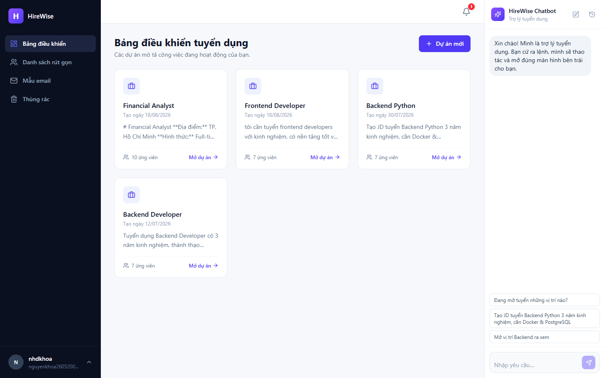
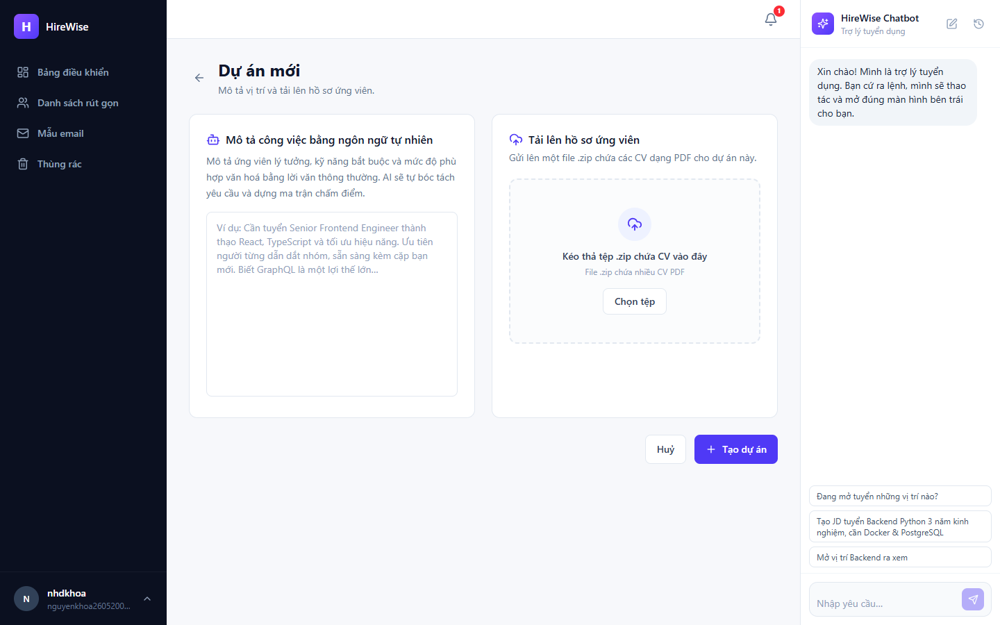
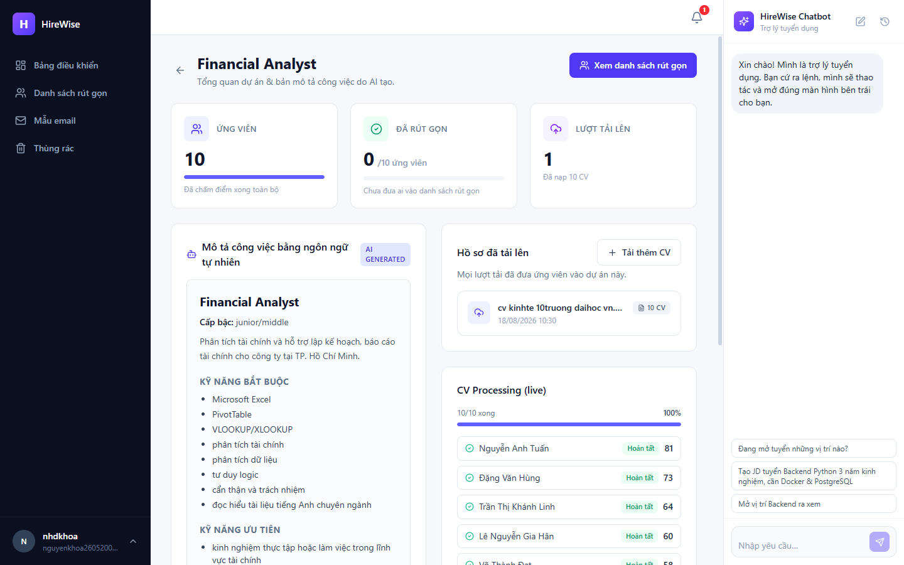
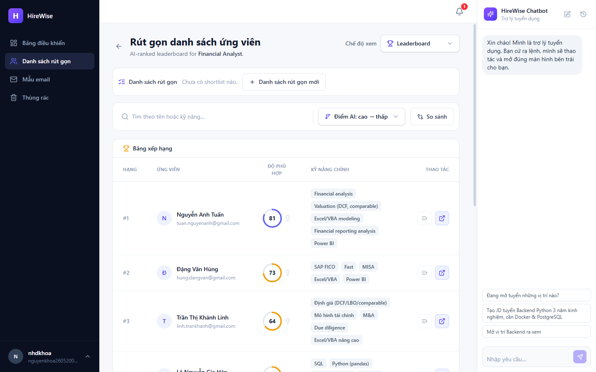
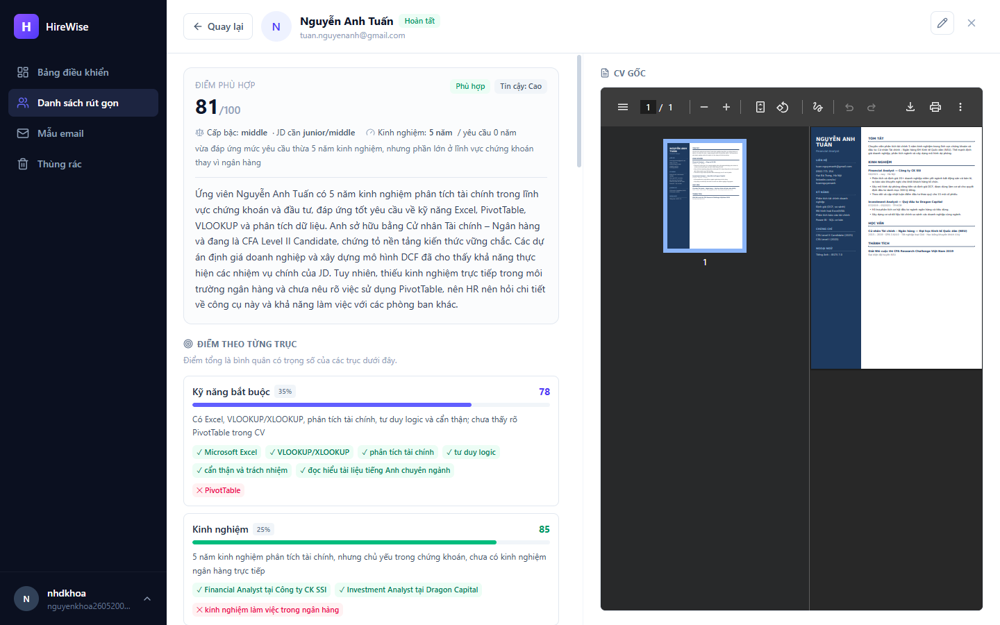
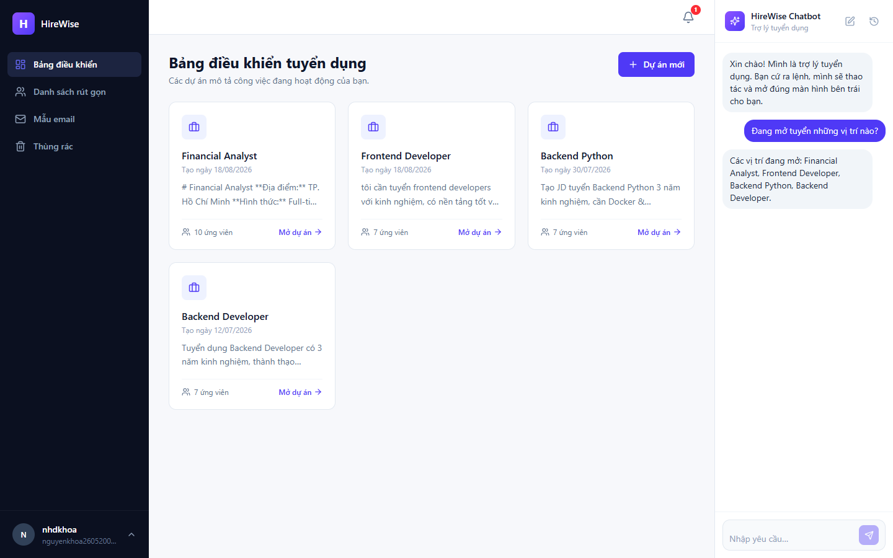
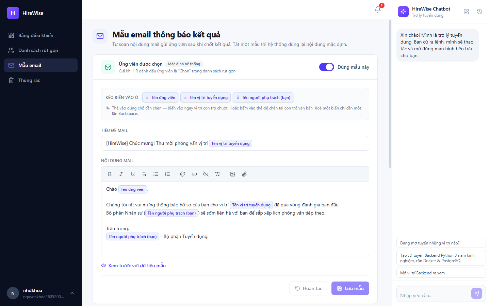
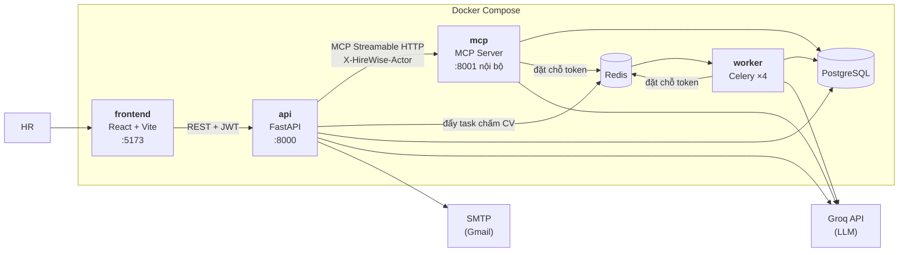

# HireWise — Hệ thống sàng lọc hồ sơ tuyển dụng bằng AI

*Tiếng Việt · [English](README.en.md)*

HireWise nhận vào một mô tả công việc viết bằng ngôn ngữ tự nhiên và một tệp ZIP chứa
hàng chục CV, rồi trả về **bảng xếp hạng ứng viên có giải thích được**: mỗi người một
điểm số phân rã theo sáu trục, kèm điểm mạnh, điểm yếu và **câu trích nguyên văn từ CV**
làm bằng chứng cho từng nhận định.

Điểm đáng nói về mặt kỹ thuật không nằm ở chỗ "gọi LLM chấm CV", mà ở ba chỗ khó:

- **Điểm số phải truy ra được.** Trọng số nằm trong code, không để model tự chọn; điểm
  tổng do code nhân trọng số rồi cộng lại. HR luôn giải thích được vì sao 62 là 62.
- **Free tier phải chạy trọn.** Groq chặn theo *token mỗi phút*, không phải theo số
  request. Một ZIP 15 CV vượt trần ngay lập tức nếu bắn thẳng. Hệ thống có bộ điều tiết
  đặt chỗ token trên Redis, dùng chung cho mọi tiến trình.
- **AI Agent chạy thật qua MCP.** Khung chat của HR gọi tool qua **Model Context
  Protocol** (Streamable HTTP) chứ không gọi thẳng hàm Python, có đường dự phòng và có
  ranh giới danh tính rõ ràng giữa hai bên.

> Đồ án môn **Nhập môn Công nghệ phần mềm** — Trường ĐH Khoa học Tự nhiên, ĐHQG-HCM.
> 06/2026 – 08/2026, 111 commit.

---

## Mục lục

- [Tính năng](#tính-năng)
- [Giao diện](#giao-diện)
- [Kiến trúc](#kiến-trúc)
- [Công nghệ](#công-nghệ)
- [Cách chấm điểm một CV](#cách-chấm-điểm-một-cv)
- [AI Agent và MCP](#ai-agent-và-mcp)
- [Điều tiết hạn mức LLM](#điều-tiết-hạn-mức-llm)
- [Bảo mật và phân quyền](#bảo-mật-và-phân-quyền)
- [Chạy dự án](#chạy-dự-án)
- [Biến môi trường](#biến-môi-trường)
- [Kiểm thử](#kiểm-thử)
- [Cấu trúc thư mục](#cấu-trúc-thư-mục)
- [API](#api)
- [Cơ sở dữ liệu](#cơ-sở-dữ-liệu)

---

## Tính năng

| Nhóm | Mô tả |
|---|---|
| Tài khoản | Đăng ký / đăng nhập JWT, xác minh email bằng mã OTP 6 số, đổi mật khẩu, hai vai trò `admin` và `hr_staff` |
| Mô tả công việc | Viết JD bằng ngôn ngữ tự nhiên, LLM bóc thành cấu trúc (kỹ năng bắt buộc / ưu tiên, số năm kinh nghiệm, học vấn, ngoại ngữ, trách nhiệm) rồi dựng lại thành JD markdown cho HR duyệt |
| Nạp hồ sơ | Tải ZIP nhiều CV, giải nén, trích text bằng PyMuPDF, khử trùng lặp theo SHA-256, theo dõi tiến độ từng lô upload |
| Chấm điểm | Hàng đợi Celery chấm nền, thang điểm 6 trục có trọng số cố định, kèm bằng chứng trích nguyên văn từ CV |
| Xếp hạng | Bảng xếp hạng theo dự án, HR ghi đè được điểm AI — thay đổi bị đánh dấu và lưu lịch sử chỉnh sửa |
| So sánh | Đặt nhiều ứng viên lên bàn cân theo một khía cạnh do HR nêu, LLM đọc CV gốc và biện luận trực diện |
| Phỏng vấn | Sinh bộ câu hỏi bám vào dự án thật trong CV và xoáy vào điểm yếu, chấm câu trả lời, tổng kết buổi phỏng vấn |
| Danh sách rút gọn | Chốt nhận / loại, gửi thư mời phỏng vấn và thư báo kết quả, theo dõi trạng thái gửi từng người |
| Mẫu email | Hai mẫu thư (được chọn / bị từ chối) với token động `{candidate_name}`, `{jd_title}`, `{hr_name}` và tệp đính kèm riêng cho mỗi HR |
| Copilot | Khung chat gọi 20 tool qua MCP: tra cứu, tạo JD, sinh câu hỏi, gửi thư, và điều hướng luôn màn hình đang mở |
| Quản trị | Quản lý tài khoản, nhật ký hệ thống / audit / lời gọi LLM / lời gọi tool, chỉ số nghiệp vụ, xuất CSV, thông báo toàn hệ thống |
| Thùng rác | Xoá mềm dự án, khôi phục hoặc xoá vĩnh viễn |

---

## Giao diện

### Bảng điều khiển

Mỗi thẻ là một chiến dịch tuyển cho một vị trí, kèm số ứng viên đã nạp. Cột bên phải
là khung chat Copilot — từ `lg` trở lên nó nằm cố định chứ không phải mở ra đóng vào.



### Tạo dự án

Hai ô, một luồng: mô tả vị trí bằng lời văn thông thường ở bên trái, thả tệp `.zip`
chứa CV ở bên phải. LLM bóc mô tả thành JD có cấu trúc, còn ZIP được giải nén và đẩy
vào hàng đợi chấm điểm ngay trong cùng một lần bấm.



### Chi tiết dự án

JD do AI sinh nằm bên trái, lô hồ sơ đã tải lên và tiến độ chấm điểm nằm bên phải.
Khối *CV Processing (live)* hiện trạng thái từng ứng viên theo thời gian thực — giao
diện poll `GET /jds/{id}/candidates` trong lúc worker Celery còn chạy.



### Bảng xếp hạng

Xếp theo điểm phù hợp, kèm kỹ năng chính rút từ CV. Thứ tự này dùng chung một hàm xếp
hạng với danh sách rút gọn (`app/core/ranking.py`) để hai bảng không bao giờ hiện hai
thứ tự khác nhau cho cùng một nhóm ứng viên trùng điểm.



### Chi tiết ứng viên — điểm số truy ra được

Đây là màn hình trả lời câu hỏi *"81 điểm này ở đâu ra?"*. Điểm tổng nằm trên cùng,
bên dưới là từng trục kèm trọng số của nó (kỹ năng bắt buộc 35%, kinh nghiệm 25%…), và
dưới mỗi trục là các mẩu bằng chứng: dấu ✓ cho thứ tìm thấy trong CV, dấu ✕ cho thứ JD
đòi mà CV không có. CV gốc mở ngay bên cạnh để đối chiếu.



Nút bút chì ở góc trên cho phép HR ghi đè điểm của AI. Thay đổi bị đánh dấu, lưu vào
`evaluation_overrides` kèm giá trị cũ, người sửa và mốc thời gian, rồi bảng xếp hạng
tính lại.

### Copilot

HR gõ yêu cầu bằng tiếng Việt; agent chọn tool, gọi qua MCP, rồi trả lời. Ảnh dưới là
một lượt `list_jds` thật.



### Mẫu email

Trình soạn thảo cho hai mẫu thư (được chọn / bị từ chối). Các biến động được kéo thả
như một khối liền chứ không phải gõ tay `{candidate_name}` — bấm Backspace một lần là
xoá cả biến, không để lại mảnh cú pháp vỡ.



> Mọi ảnh trên đều **sinh tự động** bằng `npm run screenshots` trong `src/frontend`,
> nên chụp lại lúc nào cũng ra đúng một kích thước. Cách chạy nằm ở
> [`docs/screenshots/README.md`](docs/screenshots/README.md).

---

## Kiến trúc



Vai trò từng service:

- **frontend** — giao diện HR và Cổng quản trị. Dev server proxy mọi prefix của backend
  nên phía Python không cần cấu hình CORS.
- **api** — nguồn sự thật về dữ liệu và là **cửa duy nhất** người dùng đi vào: xác thực,
  phân quyền, giới hạn dữ liệu theo chủ sở hữu, gửi mail, và làm **MCP client** cho khung
  chat. Cũng là service duy nhất chạy migration lúc khởi động.
- **worker** — Celery, 4 tiến trình song song, chấm điểm CV nền để request upload không
  bị chặn. Con số 4 khớp với số "ngăn" ngân sách token độc lập: 2 tài khoản Groq × 2 model.
- **mcp** — **MCP server nội bộ**, cố ý không publish cổng ra host. Chỉ `api` gọi tới,
  qua tên `mcp` trong mạng Docker.
- **redis** — vừa là broker của Celery (DB 0, kết quả ở DB 1), vừa là **sổ sách hạn mức
  LLM dùng chung** (DB 2) cho cả ba tiến trình gọi API.

---

## Công nghệ

| Tầng | Công nghệ |
|---|---|
| Frontend | React 18, react-router-dom 6, Vite 6, Tailwind CSS v4, lucide-react |
| Backend | Python 3.11, FastAPI, SQLAlchemy 2, Alembic, Pydantic v2, python-jose (JWT), passlib + bcrypt |
| Xử lý nền | Celery 5 + Redis |
| AI | Groq (OpenAI-compatible), **MCP SDK 1.12+** (Streamable HTTP) |
| Đọc CV | PyMuPDF |
| Dữ liệu | PostgreSQL 15 |
| Hạ tầng | Docker, Docker Compose |
| Kiểm thử | pytest, Playwright, Locust |

---

## Cách chấm điểm một CV

**1. Nạp hồ sơ.** ZIP được giải nén trong bộ nhớ; chỉ lấy các mục `.pdf`. Mỗi file được
trích text bằng PyMuPDF và băm SHA-256 — băm này vừa để khử trùng lặp trong cùng một dự
án, vừa để đặt tên file lưu trữ. CV là ảnh scan sẽ ra text rỗng và bị đánh `FAILED` kèm
lý do, chứ không kẹt im lặng ở trạng thái chờ.

**2. Đẩy vào hàng đợi.** Request upload trả về ngay sau khi tạo bản ghi ứng viên; việc
chấm điểm do worker Celery làm nền. Giao diện poll `GET /jds/{id}/candidates` để cập nhật
tiến độ.

**3. Bóc CV rồi chấm điểm — hai lượt gọi LLM, không phải ba.** Bản đầu tiên gọi ba lượt
mỗi CV và gửi toàn văn CV tới hai lần (bóc thông tin + tìm bằng chứng). Riêng khoản đó đã
ngốn khoảng 40% ngân sách token mỗi CV, khiến upload 15 CV chắc chắn đụng trần. Việc tìm
bằng chứng được gộp vào chính lượt chấm điểm, và lượt đó chỉ nhận thông tin **đã bóc**
chứ không nhận lại CV gốc.

**4. Thang điểm cố định trong code.**

| Trục | Trọng số | Chấm cái gì |
|---|---:|---|
| Kỹ năng bắt buộc | 35 | Mức đáp ứng `required_skills`, tính cả kỹ năng tương đương |
| Kinh nghiệm | 25 | Số năm **và** mức liên quan của công việc đã làm với trách nhiệm của JD |
| Dự án & thành tựu | 15 | Ưu tiên kết quả đo lường được hơn danh sách công nghệ |
| Học vấn | 10 | Bằng cấp và chuyên ngành; kinh nghiệm mạnh bù được bằng cấp lệch |
| Ưu tiên & chứng chỉ | 10 | `preferred_skills`, chứng chỉ, giải thưởng, kỹ năng mềm |
| Ngoại ngữ | 5 | JD không yêu cầu thì cho điểm trung tính, không phạt |

Trọng số **nằm ở code, không để model tự chọn**, và điểm tổng do code nhân trọng số rồi
cộng lại. Bản trước để model trả thẳng một `score` bên cạnh `score_breakdown`; hai thứ đó
không ràng buộc nhau nên thường xuyên gặp cảnh breakdown 90/85/80 mà tổng lại ra 62. Cố
định công thức khiến điểm số vừa giải thích được từng phần, vừa **so sánh được giữa các
ứng viên** vì mọi người dùng chung một thước đo.

**5. Bằng chứng.** Với mỗi điểm mạnh / điểm yếu, model phải trả về câu trích **nguyên
văn** trong CV, hoặc `null` nếu không tìm thấy — HR bấm vào là thấy đúng chỗ trong CV
gốc, không phải tin lời model.

**6. Hết ngân sách thì hẹn lại, không đánh trượt.** Vướng hạn mức Groq, task được Celery
hẹn chạy lại (tối đa 12 lần). Chỉ khi cạn hết lượt, ứng viên mới bị đánh `FAILED` kèm
thông báo — để HR nhìn màn hình không tưởng là hệ thống vẫn đang chạy.

---

## AI Agent và MCP

Khung chat Copilot không phải một chatbot trả lời suông: LLM là chương trình chính, tự
chọn và gọi tool để đọc/ghi dữ liệu tuyển dụng thật.

```
run_agent  ──►  mcp_client  ──(Streamable HTTP)──►  MCP server  ──►  agent_tools  ──►  DB
```

Danh sách tool **không hard-code**: backend hỏi MCP server `list_tools()` rồi đưa schema
đó cho LLM. Hiện có 20 tool, chia ba nhóm — tra cứu (`list_jds`, `search_candidates`,
`compare_candidates`...), ghi dữ liệu (`create_jd`, `create_shortlist`,
`send_interview_invite`, `set_candidate_decision`...) và điều hướng giao diện
(`open_jd`, `open_dashboard`, `open_shortlisting`).

Bốn quyết định thiết kế đáng chú ý:

**Một nguồn sự thật cho bộ tool.** Trước đây tool được mô tả ở hai nơi viết tay song
song: JSON schema cho Groq, và các wrapper `@mcp.tool()` trong MCP server. Hai bản đã
trôi lệch thật — `send_interview_invite` có ở bản Groq nhưng chưa từng được đăng ký trên
MCP server, trong khi system prompt vẫn dặn LLM dùng nó, nên đường chính không có cách
nào gửi thư mời phỏng vấn. Giờ chỉ còn `tool_registry.py`; cả MCP server lẫn đường dự
phòng đều **sinh ra** từ nó. Thêm một tool = thêm một `ToolSpec`.

**Danh tính đi theo phiên, không theo lời gọi tool.** `X-HireWise-Actor` là header của
phiên MCP, nên `acting_user_id` không nằm trong schema — LLM không nhìn thấy và không
mạo danh được. Server vẫn xác minh lại danh tính đó với bảng `users`. `owner_id` được
tiêm vào **mọi** tool (không chỉ tool ghi), nên một tool thêm sau này không thể vô tình
đọc dữ liệu của HR khác.

**Dự phòng có kiểm soát.** MCP chết thì agent tự quay về gọi thẳng hàm Python để sản phẩm
không đứng giữa buổi demo. Nhưng nếu MCP đứt **sau** khi một tool ghi đã chạy xong thì
tuyệt đối không chạy lại cả lượt — làm vậy sẽ tạo JD lần hai, gửi email lần hai. Trường
hợp đó báo lỗi trung thực cho HR. Annotation `read_only` của MCP được dùng thật để phân
biệt hai tình huống này.

**Mọi tool chạy trong worker thread.** FastMCP gọi tool đồng bộ thẳng trên event loop, mà
tool ở đây là code chặn (query psycopg2, gọi LLM, `sleep` của bộ điều tiết). Để nguyên
thì một lượt sinh câu hỏi cho 8 ứng viên giữ loop hàng chục giây: client thứ hai không
được đọc request, `/healthz` không trả lời nên Docker đánh dấu unhealthy, và stream
Streamable HTTP không gửi nổi keep-alive nên phiên đứt giữa chừng.

---

## Điều tiết hạn mức LLM

Giới hạn của Groq tính theo **tài khoản**, không theo tiến trình. Trước đây mỗi worker
Celery cứ thấy task là gọi thẳng API, nên upload một ZIP 15 CV bắn ra gần như đồng thời
hàng chục lời gọi — 429 hàng loạt, retry mù, rồi CV bị đánh `FAILED`.

Cách làm hiện tại: đếm số request và số token đã tiêu trong cửa sổ phút/ngày **trên
Redis**, nơi duy nhất mọi container nhìn thấy chung. Trước mỗi lời gọi phải **đặt chỗ**
trước phần token ước tính; hết ngân sách thì nằm chờ tới lúc cửa sổ mở lại thay vì bắn
rồi ăn 429. Cửa sổ cố định chứ không trượt — đơn giản hơn nhiều và vẫn an toàn vì chỉ
tiêu thụ 85% hạn mức thật.

Ba tuyến phòng thủ, theo thứ tự: đặt chỗ token trước → đọc `retry-after` của Groq khi vẫn
ăn 429 → ném `LLMBudgetExhausted` để Celery hẹn giờ chạy lại CV đó.

Ngân sách còn được **chia ngăn**: pipeline chấm CV dùng hai tài khoản Groq riêng (gấp đôi
token), còn khung chat Copilot dùng một key thứ ba — để một lượt upload nặng không làm
HR mất luôn phần trò chuyện.

---

## Bảo mật và phân quyền

- **JWT + bcrypt 12 vòng.** Đăng ký phải xác minh email bằng mã OTP 6 số mới kích hoạt
  được tài khoản.
- **Hai vai trò.** `hr_staff` dùng phần tuyển dụng, `admin` dùng Cổng quản trị. Route
  guard phía React chỉ là tiện ích điều hướng; lớp chặn thật nằm ở
  `app/core/dependencies.py`.
- **Giới hạn dữ liệu theo chủ sở hữu.** Mọi truy vấn nghiệp vụ đi qua các guard trong
  `app/core/ownership.py` (`get_owned_jd`, `get_owned_candidate`, `get_owned_shortlist`...),
  nên một HR không đọc được dự án của HR khác kể cả khi biết UUID.
- **Cổng MCP không mở ra host.** Publish cổng 8001 là mở một đường đi thẳng vào dữ liệu
  tuyển dụng, không qua đăng nhập và không qua JWT. Bản trước từng bind `0.0.0.0:8001`,
  nghĩa là cả mạng LAN với tay tới được. Nay chỉ container `api` gọi được, và mọi request
  vẫn phải mang `Authorization: Bearer $MCP_AUTH_TOKEN`. Thiếu biến môi trường đó, MCP
  server **từ chối khởi động** — chạy tiếp trong im lặng là cách sinh ra một endpoint
  đọc/ghi ẩn danh.
- **Nhật ký.** Bốn bảng log riêng: `audit_logs` (thao tác của người dùng), `system_logs`,
  `ai_logs` (từng lời gọi LLM kèm token và độ trễ), `agent_tool_logs` (từng tool agent đã
  gọi, với tham số nào). Admin xuất được CSV từ giao diện.

---

## Chạy dự án

**Yêu cầu:** Docker + Docker Compose.

```bash
git clone https://github.com/chovy02/HireWise.git
cd HireWise
cp .env.example .env
```

Mở `.env` và điền tối thiểu: mật khẩu PostgreSQL, `SECRET_KEY`, `MCP_AUTH_TOKEN` và ít
nhất một key Groq. Phần SMTP có thể để trống — các tính năng mail sẽ báo "chưa cấu hình"
thay vì làm hỏng luồng khác.

```bash
docker compose up --build
```

| Service | URL |
|---|---|
| Frontend | http://localhost:5173 |
| Backend | http://localhost:8000 |
| Tài liệu API (Swagger UI) | http://localhost:8000/docs |
| PostgreSQL | `localhost:5433` |
| Redis | `localhost:6379` |
| MCP server | *không publish — chỉ gọi được từ trong mạng Docker* |

Lần `up` đầu tiên, service `api` chạy `python -m app.prestart` trước khi uvicorn nhận
request: đợi Postgres sẵn sàng rồi đồng bộ schema. Thiếu bước này, máy nào còn volume DB
cũ sẽ crash ngay lúc khởi động vì thiếu cột, và frontend chỉ hiện "Backend not reachable".
**Chỉ** service `api` chạy migration — cả ba container dùng chung image, để cả ba cùng
migrate là để chúng đua nhau trên một database.

Tài khoản admin được tạo tự động lúc khởi động theo `DEFAULT_ADMIN_EMAIL` /
`DEFAULT_ADMIN_PASSWORD`. Đăng nhập lần đầu bằng cặp đó rồi tạo tài khoản HR trong Cổng
quản trị (tài khoản do admin tạo được kích hoạt ngay, không cần xác minh email).

### REPL thử agent không cần giao diện

```bash
docker exec -it hirewise_api python agent_repl.py --debug
```

Gõ câu hỏi tiếng Việt, cờ `--debug` in ra agent đã gọi tool nào với tham số gì.

---

## Biến môi trường

Không file `.env` nào được commit. Xem [`.env.example`](.env.example) để biết đầy đủ.

| Biến | Dùng để |
|---|---|
| `POSTGRES_USER` / `POSTGRES_PASSWORD` / `POSTGRES_DB` | Khởi tạo PostgreSQL |
| `DATABASE_URL` | Chuỗi kết nối của backend — host phải là `db`, không phải `localhost` |
| `SECRET_KEY` | Khoá ký JWT. Sinh mới: `openssl rand -hex 32` |
| `DEFAULT_ADMIN_EMAIL` / `DEFAULT_ADMIN_PASSWORD` | Tài khoản admin seed lúc khởi động |
| `MCP_AUTH_TOKEN` | Bearer token của cổng MCP nội bộ. **Thiếu thì MCP server không khởi động** |
| `MAIL_USERNAME` / `MAIL_PASSWORD` / `MAIL_FROM` / `MAIL_SERVER` / `MAIL_PORT` | SMTP. Gmail phải dùng App Password 16 ký tự |
| `GROQ_API_KEY_1` / `GROQ_API_KEY_2` | Hai tài khoản cho pipeline chấm CV — gấp đôi ngân sách token |
| `GROQ_MCP_API_KEY` | Key riêng cho khung chat Copilot, tách ngăn khỏi pipeline |
| `GROQ_MODEL` / `GROQ_MODEL_BACKUP` / `GROQ_MODEL_FAST` / `GROQ_FALLBACK_MODELS` | Chuỗi model chính và các bậc rơi dần |
| `LLM_SAFETY_RATIO` | Phần hạn mức thật được phép tiêu, mặc định `0.85` |

---

## Kiểm thử

### Test backend — 82 case, chạy offline

Không gọi API ngoài, không cần key. Chạy trong container `mcp` vì bộ test MCP cần đọc
`server.py` (chỉ container này mount nó):

```bash
docker exec hirewise_mcp sh -c "cd /app && python -m pytest tests -q"
```

<!-- Kết quả lần chạy gần nhất: 82 passed. -->

Bốn nhóm, tất cả nhắm vào những chỗ đã từng hỏng thật:

| Tệp | Canh giữ điều gì |
|---|---|
| `test_agent_tools_resolve.py` | LLM viết lại tên ứng viên / vị trí rất tuỳ tiện; các cách viết nào **phải** vẫn khớp, và một tên do LLM bịa ra thì tuyệt đối không được biến thành thao tác ghi |
| `test_agent_tools_guards.py` | Yêu cầu mơ hồ trải nhiều vị trí thì phải hỏi lại và **không ghi gì** |
| `test_mcp_contract.py` | Giao kèo giữa registry, MCP server và đường dự phòng: mọi tool trong registry đều có mặt ở cả hai đường, và danh tính không bao giờ đi bằng tham số tool |
| `test_mcp_runtime.py` | `/healthz` là route duy nhất miễn xác thực; không tool nào được chặn event loop |

> Chạy trong container `api` thì 30 case MCP bị **skip** (container đó không mount
> `server.py`) — đó là hành vi đúng, không phải lỗi.

### Test end-to-end frontend

```bash
cd src/frontend
npm run test:e2e
```

Playwright tự khởi động Vite. Bộ test đăng nhập chạy được **khi backend đang tắt** vì nó
chỉ kiểm tra phần frontend tự quyết: route guard, render, điều hướng, validation.

### Đo thời gian phản hồi (NFR)

Bộ Locust trong [`src/backend/tests/load/`](src/backend/tests/load) đo độ trễ từng
endpoint rồi đối chiếu với ngân sách công bố trước và kết luận Đạt / Không đạt. Sáu nhóm
ngân sách, từ tra cứu tức thời (300 ms) tới đường gọi LLM.

Kết quả lần chạy gần nhất — [`load-report/slo-report.md`](src/backend/tests/load/load-report/slo-report.md):

| Hạng mục | Số liệu |
|---|---|
| Endpoint đo | 25 |
| Đạt ngân sách | 25 |
| Không đạt | 0 |
| Tỷ lệ lỗi HTTP | 0,0% |

Cách chuẩn bị dữ liệu và chọn hồ sơ tải nằm trong
[`tests/load/README.md`](src/backend/tests/load/README.md).

---

## Cấu trúc thư mục

```
HireWise/
├── src/
│   ├── backend/                  FastAPI — API, xác thực, nghiệp vụ, AI
│   │   ├── app/
│   │   │   ├── routers/          10 router: auth, users, cv, shortlist, interview,
│   │   │   │                       compare, agent, admin, notifications, email_templates
│   │   │   ├── services/
│   │   │   │   ├── ai_agent/     Agent loop, MCP client, registry tool, bộ chấm điểm,
│   │   │   │   │                   bộ so sánh, bộ sinh câu hỏi, bộ điều tiết hạn mức
│   │   │   │   ├── cv_processing/  Trích text PDF, lưu file
│   │   │   │   └── data_ingestion/ Giải nén ZIP, khử trùng lặp theo SHA-256
│   │   │   ├── core/             Ownership guard, RBAC, xếp hạng, Celery, bootstrap
│   │   │   ├── schemas/          Pydantic v2
│   │   │   └── models.py         21 bảng SQLAlchemy
│   │   ├── migrations/           20 revision Alembic
│   │   ├── tests/                Test offline + bộ đo tải Locust
│   │   └── agent_repl.py         REPL thử agent từ terminal
│   ├── frontend/                 React + Vite + Tailwind v4 (README riêng)
│   └── mcp_server/server.py      MCP server nội bộ, sinh tool từ registry
├── docs/
│   ├── screenshots/              Ảnh màn hình cho README (sinh bằng Playwright)
│   └── kien-truc-hirewise.drawio Sơ đồ kiến trúc
├── cv_data/                      ZIP CV mẫu để thử nghiệm
├── docker-compose.yml
└── .env.example
```

---

## API

67 endpoint, tài liệu tự sinh tại http://localhost:8000/docs. Các nhóm chính:

| Nhóm | Endpoint tiêu biểu |
|---|---|
| Xác thực | `POST /auth/register` · `POST /auth/verify-email` · `POST /auth/login` · `GET /auth/me` |
| Mô tả công việc | `POST /jds` · `GET /jds` · `GET /jds/{id}` · `DELETE /jds/{id}` · `POST /jds/{id}/restore` |
| Nạp hồ sơ | `POST /jds/{id}/cvs` (upload ZIP) · `GET /jds/{id}/uploads` · `GET /jds/{id}/candidates` |
| Ứng viên | `GET /candidates/{id}` · `GET /candidates/{id}/cv` · `POST /candidates/{id}/retry` |
| Đánh giá | `PATCH /evaluations/{id}/override` (HR ghi đè điểm AI, có lịch sử) |
| So sánh | `POST /compare` |
| Danh sách rút gọn | `POST /jds/{id}/shortlists` · `POST /shortlists/{id}/items` · `PATCH /shortlists/{id}/items/{item}` · `POST /shortlists/{id}/send-notifications` |
| Phỏng vấn | `POST /interviews/candidate/{id}/generate` · `POST /interviews/question/{id}/evaluate` · `PATCH /interviews/{id}/complete` |
| Copilot | `POST /agent/chat` · `GET /agent/sessions` |
| Mẫu email | `PUT /email-templates/{type}` · `POST /email-templates/{type}/attachments` |
| Quản trị | `GET /admin/business-metrics` · `GET /admin/ai-metrics` · `GET /admin/audit-logs` · `GET /admin/export/*` |

---

## Cơ sở dữ liệu

PostgreSQL 15, 21 bảng, schema quản lý bằng Alembic (20 revision).

Các nhóm bảng: người dùng và mẫu email · JD, lô upload, ứng viên, kỹ năng, dự án của ứng
viên · đánh giá và lịch sử ghi đè · danh sách rút gọn và các mục trong đó · buổi phỏng
vấn và câu hỏi · phiên chat và tin nhắn · bốn bảng nhật ký · thông báo.

Hai điểm đáng chú ý:

- **Mọi cột thời gian là `timestamptz`** (revision `d7f1a3c9e5b2`) và code luôn ghi
  `datetime.now(timezone.utc)`. Các container đặt `TZ=Asia/Ho_Chi_Minh` chỉ để log đọc
  được theo giờ Việt Nam — nó đổi cách **con người** đọc, không đổi cái được lưu.
- **Xoá mềm cho JD** (`deleted_at`): dự án vào Thùng rác, khôi phục được, và chỉ mất hẳn
  khi HR chọn xoá vĩnh viễn.

Sơ đồ kiến trúc: [`docs/kien-truc-hirewise.drawio`](docs/kien-truc-hirewise.drawio)
(mở bằng [draw.io](https://app.diagrams.net/)).
